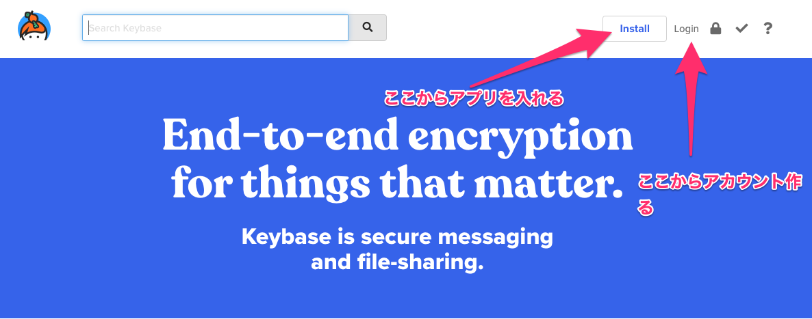
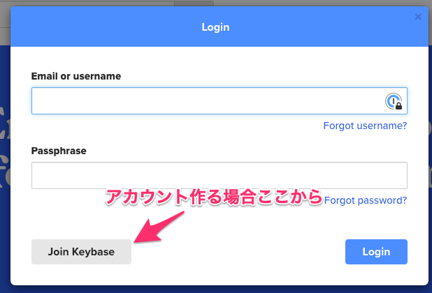
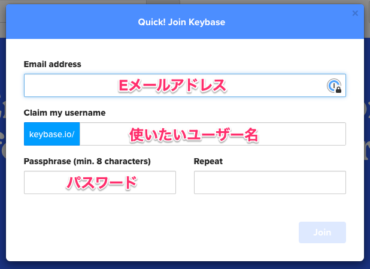
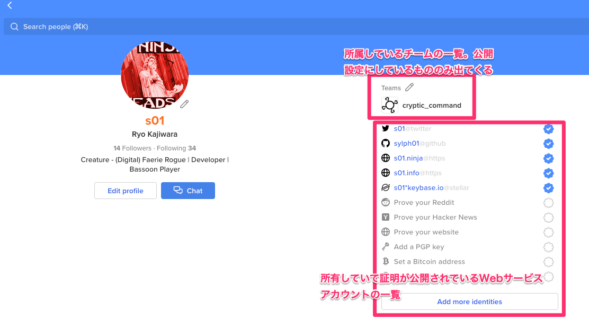

## なにそれ

[Keybase](https://keybase.io/) は

- 暗号化されたチャット・ファイル共有・Gitレポジトリ
- WebサービスのIDの暗号学的所有証明

を提供するサービス。

## なんで

**End-to-end暗号化**を**適切に**提供しているサービスの中で、最も優れたユーザー体験を提供しているサービスだからみんなに使ってほしい。

(以下詳しい説明がどうでもいい人は「どうやって」まで飛ばしてください)

----

### 暗号化？

私的な通信の秘密は **我々に与えられた人権であり** 、それを適切に実現しているサービスを利用すべきであると考える。

「こそこそしなきゃいけないことやってないんだったら暗号化しなくていいじゃん」、だって？通信の検閲が常態化している戦時下や独裁政権下に行きたいならばご勝手にどうぞ。

### 他のサービスは？

[香港の国家安全法成立を受けて書かれた暗号化メッセージングサービスを比較するエントリ](https://medium.com/@thehacksbetweenus/%E5%9C%8B%E5%AE%89%E6%B3%95%E9%80%9A%E9%81%8E-%E5%85%A8%E6%B0%91%E5%8F%8D%E7%9B%A3%E6%8E%A7-%E5%B8%B8%E7%94%A8%E9%80%9A%E8%A8%8A%E8%BB%9F%E9%AB%94%E5%93%AA%E5%80%8B%E6%9C%80%E5%AE%89%E5%85%A8-c85b642649e1)（筆者は中国語を読めないので翻訳を通して読んでる）が最近書かれている比較記事ではとてもよかったが、知っている情報と意見を改めて日本語で整理し直す。

- Facebook Messenger: **有効化しないと暗号化されない。** また鍵共有の関係から **暗号化は有効化した特定の端末でしか使えない（マルチデバイス対応していない）**。
    - IRLの関係性のある人と連絡取る方法は完全にこれになっているが、個人的にはFacebookのデータ利用があまり信用できないので本音としては避けたい。
- LINE: Letter Sealingという暗号化が **デフォルトで有効になっている。** 画面右上のハンバーガーメニューを開いて、一番下で「このトークルームはLetter Sealingが適用されています」と書かれている。安全性証明が不十分ということが書かれているが、[ProVerifを用いたモデル化と検証の記事が存在する。](https://lepidum.co.jp/blog/2018-10-26/line-proverif/)
- WhatsApp: 暗号化に安全性の検証が適切に行われている**Signalプロトコルを用いている**。上記記事ではオープンソースでないことと運営元がFacebookであることがマイナスとして挙げられている。
- Signal: 同様に **Signalプロトコルを用いている。** [エドワード・スノーデンが信用するアプリ](https://signal.org/ja/)(トップページの記述)。

### なんであえてKeybase？

前提として、Keybaseは[Keybase Key Exchange Protocol](https://book.keybase.io/docs/crypto/key-exchange)という鍵交換プロトコルを用いてマルチデバイス対応の暗号化を実現しており、[外部の機関によってプロトコルのセキュリティレビューを受けている](https://keybase.io/docs-assets/blog/NCC_Group_Keybase_KB2018_Public_Report_2019-02-27_v1.3.pdf)。

また、暗号化されたメッセージング（グループメッセージング）という上記のアプリ群の機能に加え、**ファイル共有**(OSのファイルシステムにマウントする機能も持つ)、**Gitレポジトリ共有** という他のサービスにない強力な機能を提供している。それもすべて暗号化されており、今のところ無料で使えている。

----

## どうやって

### 登録

最近は招待がなくてもアカウント作れるようになったのでWebサイト上で作れる。

### プロフィール・アカウントの所有証明

Webサービスアカウントの所有証明を追加したい場合、該当するWebサービスのところをクリックし、指定された方法でWebサービス上に投稿/証明を配置し、Keybaseから見えるようにする。Twitterの場合は所有証明は払い出された情報を自分のアカウントで投稿することによってなされる（よって鍵垢だと証明できない）。例えば私のTwitterアカウントの所有証明は[このようになっている。](https://twitter.com/s01/status/870441358372216833)

----

## 私がどうやって使っているか

主に[技術出版サークルCryptic Command](https://cryptic-command.net/)で使っている。執筆に関するやり取りは完全にKeybase上で行っている。また、ボードゲームをやるためのサブチームが存在している。

### なんであえてこの記事書いたか

ボードゲーム用のサブチーム、またCryptic Command主催のsemi-closedな集まりを開くのにKeybaseを使えると都合がよいと判断したから、というのがある。
