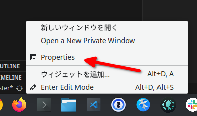
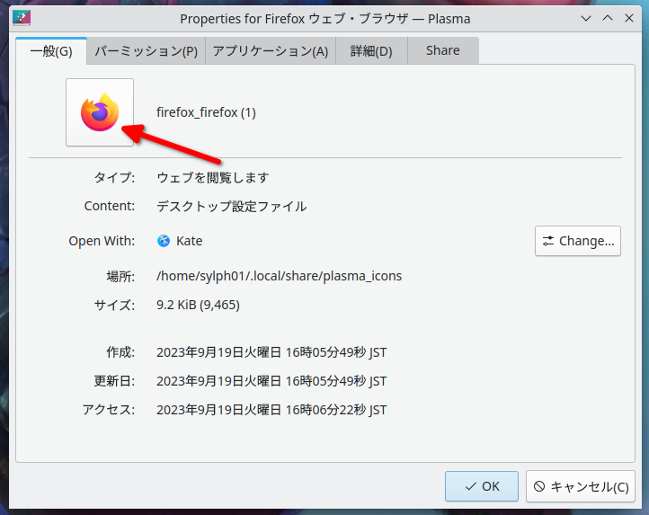
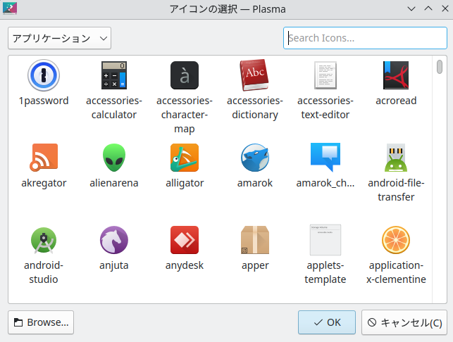
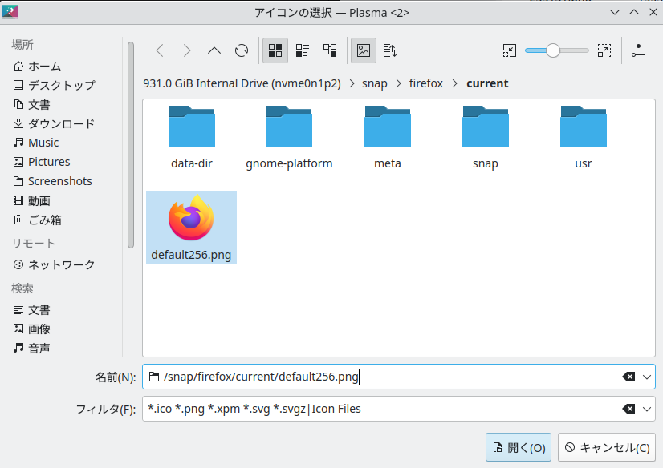

(This is more of a language-independent tech memo)

If your Firefox installation on Ubuntu (Kubuntu in my case) is managed by `snap`, then your Panel icon might become blank when your Firefox installation gets updated.

## How to fix

(1) Open "Properties" of the Firefox Panel item

(2) Select icon

(3) Click "Browse..."

(4) Enter path `/snap/firefox/current/default256.png`

## Why does this happen

When you create your Panel item from the Application Launcher, the icon's path is set to `/snap/firefox/SOME_VERSION_NUMBER/default256.png`, depending on which version number `snap` has installed. When Firefox is updated and the previous version number is deleted from disk, the icon that the Panel item looks for does not exist any more. The app itself can still be launched, since this Panel item runs `/snap/bin/firefox` instead of specifying the version number directly.